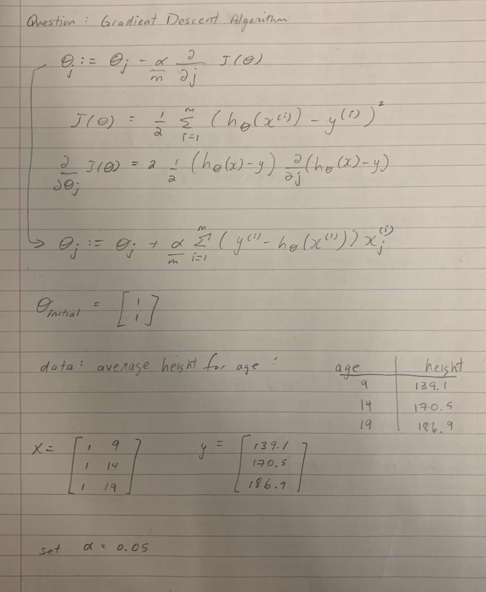
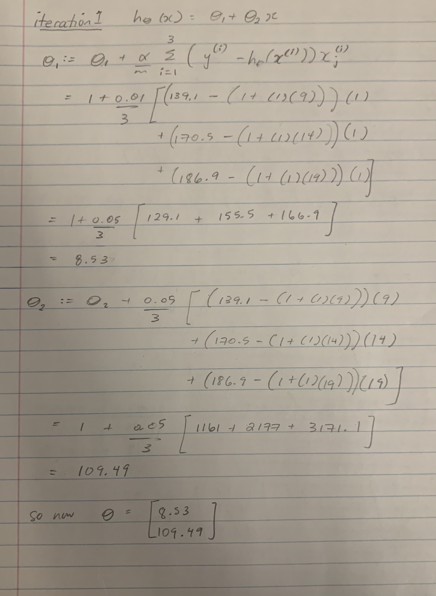
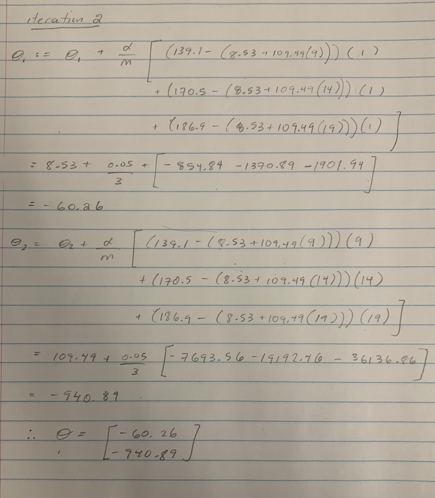

<!-- You can check templates from this website and change html theme: https://www.datadreaming.org/post/r-markdown-theme-gallery/ -->
<!-- It won't affect the PDF or Word. -->

```{r}
# Insert necessary packages
library('tidyverse')
library('gridExtra')
library('ISLR')
library('plotly')
library('caret')
```

## Question 1: Linear Regression
```{r}
# Read in the data
spotify <- read.csv('data/spotify_songs.csv')
dim(spotify)
```


### 1.1. (10 pts) 

Give basic insights into your numeric variable you have picked as output variable using one categorical variable you selected. 

- What are the min / max values and median of the output variable, $Y$?
```{r}
spotify1_1 = spotify[,c('energy','loudness','tempo','playlist_genre','danceability')]
# min
min(spotify1_1['danceability'])
# max
max(spotify1_1['danceability'])
# median
median(spotify1_1$danceability, na.rm=TRUE)
```
- What is median of the output value among different classes of the categorical variable you picked? You must use `group_by` and `summarize` functions.
```{r}
# median output among different classes
group_by(spotify1_1, playlist_genre) %>% 
  summarise(median(danceability))
```


### 1.2. (10 pts) 

Visualize the variables you selected.

- Draw histogram of the numeric variables you selected.
```{r}
# Histogram plot of numeric features

energy <- ggplot(data = spotify1_1) +
  geom_histogram(aes(x = energy), bins=20) +
  ggtitle("Histogram of Energy")

loudness <- ggplot(data = spotify1_1) +
  geom_histogram(aes(x = loudness), bins=20) + 
  ggtitle("Histogram of Loudness")

tempo <- ggplot(data = spotify1_1) +
  geom_histogram(aes(x = tempo), bins=20) + 
  ggtitle("Histogram of Tempo")

grid.arrange(energy, tempo, loudness, ncol=2)
```

- Draw distribution of the output variable $Y$ with respect to the different classes of your categorical variable. The plot must somehow show the distributional differences among different classes. You can use boxplot, histogram, or other visuals (e.g. density ringes).
```{r}
# Boxplot of categorical feature classes
ggplot(data = spotify1_1) +
  geom_boxplot(aes(x = playlist_genre, y=danceability, colour=playlist_genre)) +
  ggtitle("Boxplot of Categorical Variable")
```

- Draw scatter plot between one of your numeric inputs and the output variable. Discuss whether the plot indicate a relation, if it is linear, if there are outliers? Feel free to remove the outlier. Feel free to transform the data.
```{r}
# Plot input variable vs output variable
ggplot(data = spotify1_1) +
  geom_point(aes(x = loudness, y=danceability))

# Remove outliers
spotify1_2<-spotify1_1[(spotify1_1$loudness>-25),]
```

There does not seem to be any linear relation between the input variable (loudness) and the output variable (danceability). In terms of removing outliers, loudness values < -25 were dropped.

### 1.3. (15 pts) 

Using the all dataset, fit a regression:

1. Using the one numeric input variable fit a simple regression model.

  - Write down the model.
	- Fit the regression line.
	- Summarize the output.
	- Plot the input and output variables in a scatter plot and add the predicted values as a line.
	- Interpret the results. Is it a good fit? Is your input variable good in explaining the outputs?


The linear regression equation is:
$$Y \sim \beta_0 + \beta_1 X_1 + \beta_2 X_2 + \beta_3 X_3$$
  	
Our linear regression model for one numeric input variable, tempo, is:
$$D_i = \beta_0 + \beta_1 Tempo_i+\epsilon_i$$
To fit the line:
```{r}
spotifyfit1 <- lm(danceability ~ tempo, data = spotify1_2)
spotifyfit1
```

Summarize the output:
```{r}
summary(spotifyfit1)
```
  	
Based on the p-value, tempo is a significant factor in predicting danceability.

Plot the model:
```{r}
preds <- predict(spotifyfit1)
ggplot(spotify1_2, aes(x=tempo, y=danceability)) + 
  geom_point(alpha=.2, size=2) + 
  geom_line(aes(y=preds), colour="red")
```

From the graph, we can see that there is a slight correlation between the input
variable 'tempo' and output 'danceability'. Generally speaking, until a tempo of
around 100-125 bpm, danceability appears to increase as tempo increases. After this,
danceability decreases as tempo increases. However, it is not significant enough alone
to determine danceability, as there is a high range of possible output values
for each tempo input.
  	
2. Using all your input variables, fit a multiple linear regression model

   - Write down the model
   - Fit the regression line and summarize the output
   - Interpret the results. Is it a good fit? Are the input variables good in explaining the outputs?

Our multiple linear regression model is:
$$D_i \sim \beta_0 + \beta_1 Tempo_i + \beta_2 Energy_i + \beta_3 Loud_i +\epsilon_i$$
We will fit the model and view the summary:
```{r}
spotifyfit2 <- lm(danceability ~ tempo + energy + loudness, data = spotify1_2)
summary(spotifyfit2)
```

All three variables, tempo, energy, and loudness, appear to have a significant 
effect on danceability, however energy is a lesser factor than tempo and loudness.

Comparing the Mean Squared Error of both models, we get:
```{r}
sigma(spotifyfit1)
sigma(spotifyfit2)
```
Adding two more numerical variables slightly improved the MSE.

```{r, warning=F, message=F}
preds <- predict(spotifyfit2)
g1 <- ggplot(spotify1_2, aes(x=tempo, y=danceability)) + 
  geom_point(alpha=.3, size=1) + 
  geom_line(aes(y=preds), colour="blue")
ggplotly(g1)
```

Plotting the new fit on the same axes as the previous plot shows the difference
between a single and multivariable regression. We can see that there is more variation
in the plot of the fitting line where the graph is more dense and varied.

3. Now, do the same things as you did, but this time add an interaction between one categorical and one numeric variable.
   - Write down the model, fit to the data, summarize and interpret the results.

The model will now have the addition of the categorical variable playlist_genre.
$$D_i \sim \beta_0 + \beta_1 Tempo_i + \beta_2 Energy_i + \beta_3 Loud_i + \beta_4 Genre_i +\epsilon_i$$
   
The variable playlist_genre is a string, but we will ensure it is treated as a factor anyways
to avoid any errors.
```{r}
spotify1_2$playlist_genre <- as.factor(spotify1_2$playlist_genre)
```

```{r}
spotifyfit3 <- lm(danceability ~ tempo + energy + loudness + playlist_genre, data = spotify1_2)
summary(spotifyfit3)$coefficients
```

The addition of playlist_genre produces some interesting results. We can see that
the rap and latin genres are clear deciding factors, with significantly lower p-values
than other genres. Conversely, R&B and pop have lower p-values, meaning that those genres
alone are not significant factors in danceability.
Additionally, after adding this new variable, the p-value for tempo is very low.

```{r}
preds <- predict(spotifyfit3)
ggplot(spotify1_2, aes(x=tempo, y=danceability, colour=playlist_genre)) + 
  geom_point(alpha=.2, size=1) + 
  geom_line(aes(y=preds), colour="red")
```

The MSE of all 3 models is:
```{r}
sigma(spotifyfit1)
sigma(spotifyfit2)
sigma(spotifyfit3)
```
Adding playlist_genre to the model reduced the error more so than when we added
the additional numerical variables.

4. Which model you fit is the best in predicting the output variable? Which one is the second and third best? Rank the models based on their performance.

In order of performance from best to worst, they are:
fit3 > fit2 > fit1

### 1.4. (15 pts) 

In this section, you will do the same you did in 1.3, but this time you will first split the data into train and test.

- Select seed to fix the random numbers you will generate using `set.seed(...)`. 
- Split your data into test and train sets with 20/80 test-train ratio. 
- Fit the model to the train set and evaluate the how well the model performed on test set.
- Which model performed the best on test set? Rank the models based ion their performance.
- Is the rank the same as the one you had in 1.3?

```{r}
set.seed(1)
train_size <- floor(0.8*nrow(spotify1_2))
train_inds <- sample(1:nrow(spotify1_2), size = train_size)
test_inds  <- setdiff(1:nrow(spotify1_2), train_inds)
train <- spotify1_2[ train_inds , ] 
test  <- spotify1_2[ test_inds , ]
cat('train size:', nrow(train), '\ntest size:', nrow(test))
```

```{r}
trainfit1 <- lm(danceability ~ tempo, data = train)
#summary(trainfit1)$coefficients
trainfit2 <- lm(danceability ~ tempo + energy + loudness, data = train)
#summary(trainfit2)$coefficients
trainfit3 <- lm(danceability ~ tempo + energy + loudness + playlist_genre, data = train)
#summary(trainfit3)$coefficients
```

Apply to the test data:
```{r}
preds1 <- predict(trainfit1, newdata=test)
preds2 <- predict(trainfit2, newdata=test)
preds3 <- predict(trainfit3, newdata=test)
```

```{r}
rmse1 <- RMSE(preds1, test$danceability)
rmse2 <- RMSE(preds2, test$danceability)
rmse3 <- RMSE(preds3, test$danceability)
rmses <- c(rmse1,rmse2,rmse3)
rmses
sigma(spotifyfit1)
sigma(spotifyfit2)
sigma(spotifyfit3)
```
The models perform similarly to how they did on the full datasets. Model 3 is still
the best, followed by model 2 then model 3.
Comparing the individual models, the new Model 1 and 2 had slightly higher MSE,
but the new model 3 had a slightly lower MSE.


\pagebreak

## Question 2: Gradient Descent Algorithm (By hand)

In case you want to take a picture (screenshot) of your notebook (tablet), you can use the below lines to embed the image to the output PDF file:

```{r}




```

\pagebreak

## Question 3. Gradient Descent Algorithm


You will use horsepower as input variable and miles per gallon (mpg) as output:

```{r}
db3 <- select(Auto,  c('horsepower', 'mpg'))
head(db3)
```

1. Plot the scatterplot between `mpg` ($Y$) and `horsepower` ($X$).
    - Is the relationship positive or negative? Does mpg increase or reduce as horsepower increases?
    - Is the relationship linear?
    
```{r}
ggplot(data = Auto) + 
  geom_point(aes(x = horsepower, y = mpg)) 
```

Clearly, as seen in the plot, as horsepower increases, mpg decreases; therefore the relationship between mpg and horsepower is negative.  The relationship is also not linear.  As horsepower increases, the change between mpg gets smaller and smaller, following more closely to logarithmic behaviour.  

2. Plot the scatterplot between `log(mpg)` and `log(horsepower)`.
    - Is the relationship positive or negative?
    - Is the relationship linear?
    
```{r}
ggplot(data = Auto) + 
  geom_point(aes(x = log(horsepower), y = log(mpg))) 
```
  
Similarily to the previous plot, as horsepower increases, mpg decreases; therefore the relationship between mpg and horsepower is negative.  Now that the log is taken fo both horsepower and mpg values, the relationship is now following linear behaviour.
    
3. Which of the two versions is better for linear regression?

Since the scatterplot of the log of horsepower and log of mpg follow a linear behaviour and scatterplot of just horsepower and mpg follow non linear behaviour, then it can be concluded that the second version is better for linear regression.  


### 3.2. Fill in the code

The code below estimates the coefficients of linear regression using gradient descent algorithm. If you are given a single linear regression model;

$$Y = \beta_0 + \beta_1 X $$

where $Y=[Y_1,\dots,Y_N]^T$ and $X=[X_1,\dots,X_N]^T$ are output and input vectors containing the observations.

The algorithm estimates the parameter vector $\theta = [\beta_0,\beta_1]$ by starting with an arbitrary $\theta_0$ and adjusting it with the gradient of the loss function as:

$$\theta := \theta + \frac \alpha N X^T(Y - \theta X)$$

where $\alpha$ is the step size (or learning rate) and $(Y - \theta X)^T X$ is the gradient. At each step it calculates the gradient of the loss and adjusts the parameter set accordingly.
```{r}
GDA <- function(x, y, theta0, alpha = 0.01, epsilon = 1e-8, max_iter=25000){
  
  # Inputs
  # x      : The input variables (M columns)
  # y      : Output variables    (1 column)
  # theta0 : Initial weight vector (M+1 columns)
  
  x     <- as.matrix(x)
  y     <- as.matrix(y) 
  N     <- nrow(x)
  i     <- 0
  theta <- theta0
  x     <- cbind(1, x) # Adding 1 as first column for intercept
  imprv <- 1e10
  cost  <- (1/(2*N)) * t(x %*% theta - y) %*% (x %*% theta - y)
  delta <- 1
  while(imprv > epsilon & i < max_iter){
    i <- i + 1
    grad  <- (t(x) %*% (y-x %*% theta))
    theta <- theta + (alpha / N) * grad
    cost  <- append(cost, (1/(2*N)) * t(x %*% theta - y) %*% (x %*% theta - y))
    imprv <- abs(cost[i+1] - cost[i])
    if((cost[i+1] - cost[i]) > 0) stop("Cost is increasing. Try reducing alpha.")
  }
  if (i==max_iter){print(paste0("maximum interation ", max_iter, " was reached"))} else {
    print(paste0("Finished in ", i, " iterations"))
  }
  
  return(theta)
}

plot_line <- function(theta) {
  ggplot(Auto, aes(x=log(horsepower),y=log(mpg))) + 
    geom_point(alpha=.7) + 
    geom_abline(slope = theta[2], intercept = theta[1], colour='firebrick') + 
    ggtitle(paste0('int: ', round(theta[1],2), ', slope: ', round(theta[2],2)))
}

x <- log(Auto$horsepower)
y <- log(Auto$mpg)
theta0 <- c(1,1)
```


### 3.3. Run GDA


1. Run the code with the above parameters. How many iterations did it take to estimate the parameters?
```{r}
theta <- GDA(x, y, theta0, alpha = 0.05, epsilon = 1e-5)
plot_line(theta)
```

3.3.1) It took 3193 iterations to estimate the parameters.

2. Reduce epsilon to `1e-6`, set `alpha=0.05` run the code. 
    - How many iterations did it take to estimate the parameters?
    - Does the result improve? Why or why not?
```{r}
theta <- GDA(x, y, theta0, alpha = 0.05, epsilon = 1e-6)
plot_line(theta)
```

3.3.2) It took 7531 iterations to estimate the parameters. The results did improve because the epsilon value used is smaller than the one listed in Question 3.3.1. As the epsilon value is smaller, this means that the Gradient Descent Algorithm code only stops when the difference between the actual value and the estimated value is less than the given epsilon value. The smaller the epsilon value, the smaller the difference has to be, thus a more optimal solution is achieved.

3. Reduce alpha to `alpha=0.01`
   - How many iterations did it take?
   - Did the resulting line change? Why or why not?
```{r}
theta <- GDA(x, y, theta0, alpha = 0.01, epsilon = 1e-6)
plot_line(theta)
```

3.3.3) It took 22490 iterations to estimate the parameters. The resulting line did change because the alpha value was decreased from the previous question. This means that it will take a longer time for the solution to converge as the learning rate is smaller now.

4. Set alpha back to `alpha=0.05` and try `theta0=c(1,1)` vs. `theta0=c(1,-1)`:
   - How many iterations did it take? Which is less than the other?
   - Why starting with a negative slope have this effect?
```{r}
theta0 <- c(1,-1)
theta <- GDA(x, y, theta0, alpha = 0.05, epsilon = 1e-6)
plot_line(theta)
```

3.3.4) It took 7265 iterations to estimate the parameters with theta0=(1,-1) which was less than the amount of iterations it took theta0=(1,1) (it took 7531 iterations from Question 3.3.2). Starting with a negative slope has this effect because the data has a negative relationship as evident by the plot above. With a negative slope it matches the trend of the data and thus allows for a faster convergence to the optimal solution.

5. Reduce epsilon to `epsilon = 1e-8` and try `alpha=0.01`, `alpha=0.05` and `alpha=0.1`.
   - What effect does alpha have on iterations and resulting fitted line?
```{r}
theta0 <- c(1,1)
theta <- GDA(x, y, theta0, alpha = 0.01, epsilon = 1e-8)
q_3.3.5_1 <- plot_line(theta)
theta <- GDA(x, y, theta0, alpha = 0.05, epsilon = 1e-8)
q_3.3.5_2 <- plot_line(theta)

# setting alpha = 0.1 the cost starts to increase
# theta <- GDA(x, y, theta0, alpha = 0.1, epsilon = 1e-8)

grid.arrange(q_3.3.5_1, q_3.3.5_2, ncol=2)
```

3.3.5) The plot on the left took the maximum amount of iterations (25000), while the plot on the right took 16207 iterations. Using an alpha value of 0.1, the cost started to increase and thus the results could not be computed. The result that alpha has on the iterations is that with a lower alpha value, the learning rate is a lot smaller and thus more iterations are required to reach the optimal solution. Using alpha = 0.01 it results in a line that marginally fits the data. A higher alpha value leads to a faster learning rate and less iterations are required to reach the optimal solution. Using alpha = 0.05, it results in a line that fits the downward trend of the data much better. 
When using too large of an alpha value, it can overshoot the minimum solution and fail to converge. 

\pagebreak

## Question 4. BGD vs SGD

### 4.1 BGD and SGD functions
```{r}
BGD <- function(x, y, theta0, alpha = 0.01, epsilon = 1e-8, max_iter=25000){
  
  # Inputs
  # x      : The input variables (M columns)
  # y      : Output variables    (1 column)
  # theta0 : Initial weight vector (M+1 columns)
  
  x     <- as.matrix(x)
  y     <- as.matrix(y) 
  N     <- nrow(x)
  i     <- 0
  theta <- theta0
  x     <- cbind(1, x) # Adding 1 as first column for intercept
  imprv <- 1e10
  cost  <- (1/(2*N)) * t(x %*% theta - y) %*% (x %*% theta - y)
  delta <- 1
  while(imprv > epsilon & i < max_iter){cost
    i <- i + 1
    grad <- 0
    for(j in 1:length(y)){
      grad_chng <- x[j, ] * c(y[j]-x[j, ] %*% theta)
      grad <- grad + grad_chng
    }
    theta <- theta + (alpha / N) * grad
    cost  <- append(cost, (1/(2*N)) * t(x %*% theta - y) %*% (x %*% theta - y))
    imprv <- abs(cost[i+1] - cost[i])
    if((cost[i+1] - cost[i]) > 0) stop("Cost is increasing. Try reducing alpha.")
  }
  print(paste0("Stopped in ", i, " iterations"))
  cost <- cost[-1]
  return(list(theta,cost))
}
```

```{r}
SGD <- function(x, y, theta0, alpha = 0.01, epsilon = 1e-8, max_iter=25000){
  
  # Inputs
  # x      : The input variables (M columns)
  # y      : Output variables    (1 column)
  # theta0 : Initial weight vector (M+1 columns)
  
  x     <- as.matrix(x)
  y     <- as.matrix(y) 
  N     <- nrow(x)
  i     <- 0
  theta <- theta0
  x     <- cbind(1, x) # Adding 1 as first column for intercept
  imprv <- 1e10
  cost  <- (1/(2*N)) * t(x %*% theta - y) %*% (x %*% theta - y)
  delta <- 1
  grad <- 0
  
  for(i in 1:max_iter){cost
    for (j in 1:length(y)){
      grad_chng <- x[j, ] * c(y[j]-x[j, ] %*% theta)
      grad <- grad + grad_chng 
      theta <- theta + (alpha / N) * grad
    }
    cost  <- append(cost, (1/(2*N)) * t(x %*% theta - y) %*% (x %*% theta - y))
    imprv <- abs(cost[i+1] - cost[i])
  }
  print(paste0("Stopped in ", max_iter, " iterations"))
  cost <- cost[-1]
  return(list(theta,cost))
}
```

### 4.2 Compairing BGD and SGD
```{r}
x <- log(Auto$horsepower)
y <- log(Auto$mpg)
resBGD <- BGD(x, y, c(1, -1), alpha = 0.005, epsilon = 1e-5, max_iter = 10)
resSGD <- SGD(x, y, c(1, -1), alpha = 0.005, epsilon = 1e-5, max_iter = 10)

thetaBGD <- resBGD[[1]]
lossBGD  <- resBGD[[2]]
thetaSGD <- resSGD[[1]]
lossSGD  <- resSGD[[2]]
ggplot() + 
  geom_point(aes(x=1:length(lossBGD), y=lossBGD), colour="black") +
  geom_point(aes(x=1:length(lossSGD), y=lossSGD), colour="blue") +
  labs(x='iteration', y="loss")
```

Stochastic Gradient Descent yielded minimum loss up until the 5th iteration as it reached the min first, but after the 5th iteration, Batch Gradient Descent yielded minimum loss. The losses differ because with BGD it considers all the data points first and then updates theta. With SGD it only uses one data point at a time to update theta.
