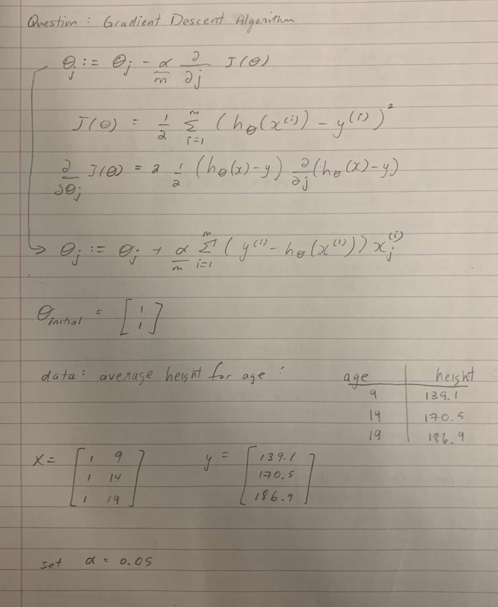
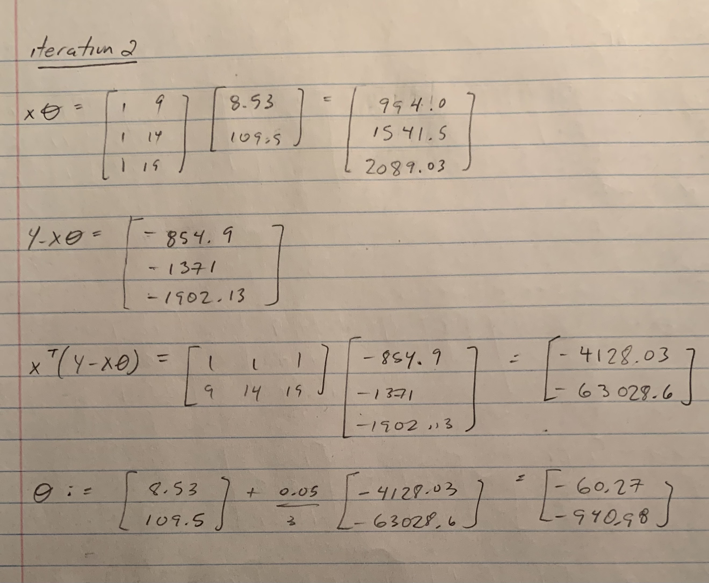
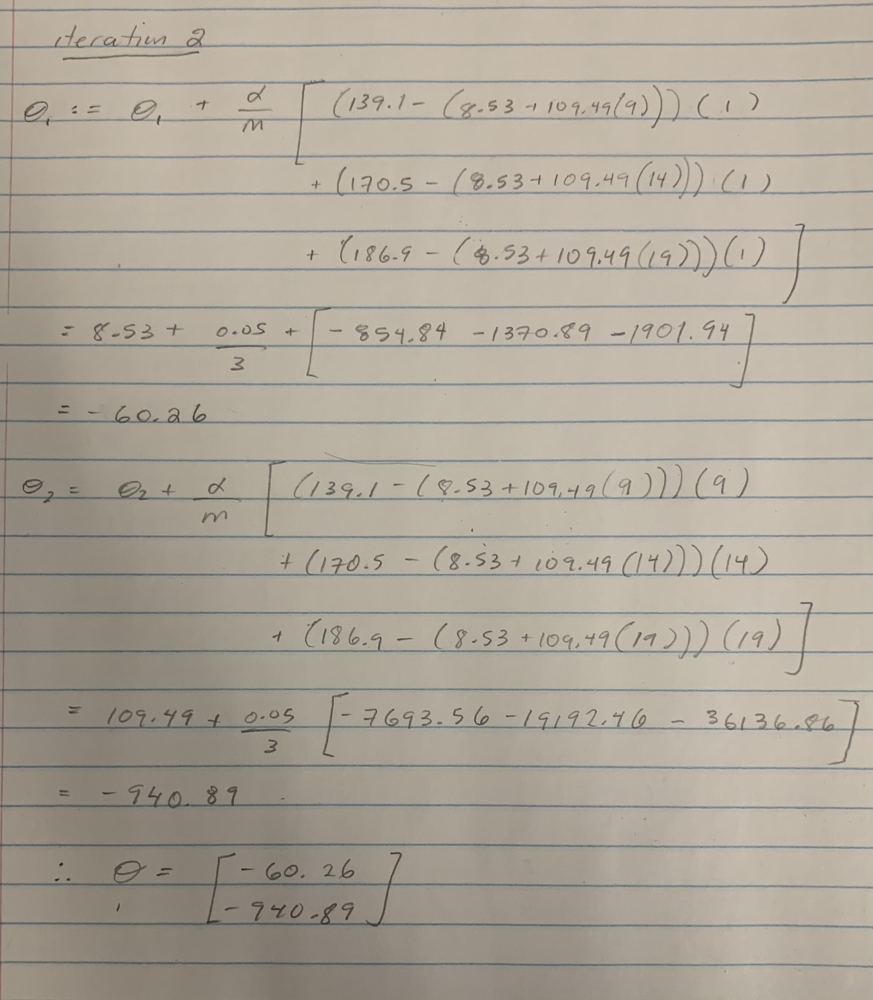

<!-- You can check templates from this website and change html theme: https://www.datadreaming.org/post/r-markdown-theme-gallery/ -->
<!-- It won't affect the PDF or Word. -->

```{r, message=FALSE}
library('tidyverse')
library('gridExtra')
library('ISLR')
```

## Question 1: Linear Regression

### 1.1. (10 pts) 

Give basic insights into your numeric variable you have picked as output variable using one categorical variable you selected. 

- What are the min / max values and median of the output variable, $Y$?
- What is median of the output value among different classes of the categorical variable you picked? You must use `group_by` and `summarize` functions.

```{r}
songs <- read.csv('spotify_songs.csv')
songs <- select(songs,  c('energy', 'loudness', 'tempo', 'playlist_genre', 'danceability'))
group_by(songs) %>% 
  summarise(minDanceability=min(danceability), maxDanceability=max(danceability))

group_by(songs, playlist_genre) %>% 
  summarise(medianDancability=median(danceability))
```

### 1.2. (10 pts) 

Visualize the variables you selected.

- Draw histogram of the numeric variables you selected.
- Draw distribution of the output variable $Y$ with respect to the different classes of your categorical variable. The plot must somehow show the distributional differences among different classes. You can use boxplot, histogram, or other visuals (e.g. density ringes).

- Draw scatter plot between one of your numeric inputs and the output variable. Discuss whether the plot indicate a relation, if it is linear, if there are outliers? Feel free to remove the outlier. Feel free to transform the data.

Histograms
```{r}
g1 <- ggplot(data = songs) + 
  geom_histogram(aes(x = energy))
g2 <- ggplot(data = songs) + 
  geom_histogram(aes(x = loudness))
g3 <- ggplot(data = songs) + 
  geom_histogram(aes(x = tempo))

grid.arrange(g1,g2,g3, ncol=2)

```

Distribution of output variable Y w.r.t. categorical variable
```{r}
ggplot(data = songs) + 
  geom_boxplot(aes(x = playlist_genre, y = danceability, colour=playlist_genre))
```

Scatter plot between one numeric input and output variable
```{r}
ggplot(data = songs) + 
  geom_point(aes(x = loudness, y = danceability)) 
```


### 1.3. (15 pts) 

Using the all dataset, fit a regression:

1. Using the one numeric input variable fit a simple regression model.

  - Write down the model.
	- Fit the regression line.
	- Summarize the output.
	- Plot the input and output variables in a scatter plot and add the predicted values as a line.
	- Interpret the results. Is it a good fit? Is your input variable good in explaining the outputs?
  	
2. Using all your input variables, fit a multiple linear regression model

   - Write down the model
   - Fit the regression line and summarize the output
   - Interpret the results. Is it a good fit? Are the input variables good in explaining the outputs?

3. Now, do the same things as you did, but this time add an interaction between one categorical and one numeric variable.
   - Write down the model, fit to the data, summarize and interpret the results.
       
4. Which model you fit is the best in predicting the output variable? Which one is the second and third best? Rank the models based on their performance.

### 1.4. (15 pts) 

In this section, you will do the same you did in 1.3, but this time you will first split the data into train and test.

- Select seed to fix the random numbers you will generate using `set.seed(...)`. 
- Split your data into test and train sets with 20/80 test-train ratio. 
- Fit the model to the train set and evaluate the how well the model performed on test set.
- Which model performed the best on test set? Rank the models based ion their performance.
- Is the rank the same as the one you had in 1.3?


\pagebreak

## Question 2: Gradient Descent Algorithm (By hand)

In case you want to take a picture (screenshot) of your notebook (tablet), you can use the below lines to embed the image to the output PDF file:

https://censusatschool.ca/data-results/2017-2018/average-height-by-age/

```{r}
age_height <- read.csv('age_height.csv')
age_height



```

\pagebreak

## Question 3. Gradient Descent Algorithm


### 3.1. Get familiar

You will use horsepower as input variable and miles per gallon (mpg) as output:

```{r}
db3 <- select(Auto,  c('horsepower', 'mpg'))
head(db3)
```

1. Plot the scatterplot between `mpg` ($Y$) and `horsepower` ($X$).
    - Is the relationship positive or negative? Does mpg increase or reduce as horsepower increases?
    - Is the relationship linear?
    
```{r}
ggplot(data = Auto) + 
  geom_point(aes(x = horsepower, y = mpg)) 
```

Clearly, as seen in the plot, as horsepower increases, mpg decreases; therefore the relationship between mpg and horsepower is negative.  The relationship is also not linear.  As horsepower increases, the change between mpg gets smaller and smaller, following more closely to logarithmic behaviour.  

2. Plot the scatterplot between `log(mpg)` and `log(horsepower)`.
    - Is the relationship positive or negative?
    - Is the relationship linear?
    
```{r}
ggplot(data = Auto) + 
  geom_point(aes(x = log(horsepower), y = log(mpg))) 
```
  
Similarily to the previous plot, as horsepower increases, mpg decreases; therefore the relationship between mpg and horsepower is negative.  Now that the log is taken fo both horsepower and mpg values, the relationship is now following linear behaviour.
    
3. Which of the two versions is better for linear regression?

Since the scatterplot of the log of horsepower and log of mpg follow a linear behaviour and scatterplot of just horsepower and mpg follow non linear behaviour, then it can be concluded that the second version is better for linear regression.  

### 3.2. Fill in the code

The code below estimates the coefficients of linear regression using gradient descent algorithm. If you are given a single linear regression model;

$$Y = \beta_0 + \beta_1 X $$

where $Y=[Y_1,\dots,Y_N]^T$ and $X=[X_1,\dots,X_N]^T$ are output and input vectors containing the observations.

The algorithm estimates the parameter vector $\theta = [\beta_0,\beta_1]$ by starting with an arbitrary $\theta_0$ and adjusting it with the gradient of the loss function as:

$$\theta := \theta + \frac \alpha N X^T(Y - \theta X)$$

where $\alpha$ is the step size (or learning rate) and $(Y - \theta X)^T X$ is the gradient. At each step it calculates the gradient of the loss and adjusts the parameter set accordingly.

```{r}
GDA <- function(x, y, theta0, alpha = 0.01, epsilon = 1e-8, max_iter=25000){
  
  # Inputs
  # x      : The input variables (M columns)
  # y      : Output variables    (1 column)
  # theta0 : Initial weight vector (M+1 columns)
  
  x     <- as.matrix(x)
  y     <- as.matrix(y) 
  N     <- nrow(x)
  i     <- 0
  theta <- theta0
  x     <- cbind(1, x) # Adding 1 as first column for intercept
  imprv <- 1e10
  cost  <- (1/(2*N)) * t(x %*% theta - y) %*% (x %*% theta - y)
  delta <- 1
  while(imprv > epsilon & i < max_iter){
    i <- i + 1
    grad  <- (t(x) %*% (y-x %*% theta))
    theta <- theta + (alpha / N) * grad
    cost  <- append(cost, (1/(2*N)) * t(x %*% theta - y) %*% (x %*% theta - y))
    imprv <- abs(cost[i+1] - cost[i])
    if((cost[i+1] - cost[i]) > 0) stop("Cost is increasing. Try reducing alpha.")
  }
  if (i==max_iter){print(paste0("maximum interation ", max_iter, " was reached"))} else {
    print(paste0("Finished in ", i, " iterations"))
  }
  
  return(theta)
}

plot_line <- function(theta) {
  ggplot(Auto, aes(x=log(horsepower),y=log(mpg))) + 
    geom_point(alpha=.7) + 
    geom_abline(slope = theta[2], intercept = theta[1], colour='firebrick') + 
    ggtitle(paste0('int: ', round(theta[1],2), ', slope: ', round(theta[2],2)))
}
```

### 3.3. Run GDA


1. Run the code with the above parameters. How many iterations did it take to estimate the parameters?

```{r}
x <- log(Auto$horsepower)
y <- log(Auto$mpg)
theta0 <- c(1,1)
theta   <- GDA(x, y, theta0, alpha = 0.05, epsilon = 1e-5)
plot_line(theta)
```
The above estimation of parameters with gradient descent took 3193 iterations.

2. Reduce epsilon to `1e-6`, set `alpha=0.05` run the code. 
    - How many iterations did it take to estimate the parameters?
    - Does the result improve? Why or why not?
    
```{r}
theta0 <- c(1,1)
theta   <- GDA(x, y, theta0, alpha = 0.05, epsilon = 1e-6)
plot_line(theta)
```
The above estimation of parameters with gradient descent took 7531 iterations.  The resulting linear estimation is an improvement on the previous case due to the decrease in epsilon value.  The while loop to stop gradient descent only ends once the improvement is less than epsilon.  By decreasing epsilon, it means the final values are closer to optimal estimation.  

3. Reduce alpha to `alpha=0.01`
   - How many iterations did it take?
   - Did the resulting line change? Why or why not?
   
```{r}
theta0 <- c(1,1)
theta   <- GDA(x, y, theta0, alpha = 0.01, epsilon = 1e-6)
plot_line(theta)
```
The above estimation of parameters with gradient descent took 22490 iterations.  The resulting line did change when decreasing alpha.  As alpha, which represents the learning rate, decreases, then the estimation is slower to reaching the optimal location.  This also makes sense why the estimation took a lot more iterations, as the learning rate and hence improvement towards optimal is a lot slower.

4. Set alpha back to `alpha=0.05` and try `theta0=c(1,1)` vs. `theta0=c(1,-1)`:
   - How many iterations did it take? Which is less than the other?
   - Why starting with a negative slope have this effect?
   
```{r}
theta0 <- c(1,1)
theta   <- GDA(x, y, theta0, alpha = 0.05, epsilon = 1e-6)
plot_q3_3_4_1 <- plot_line(theta)
theta0 <- c(1,-1)
theta   <- GDA(x, y, theta0, alpha = 0.05, epsilon = 1e-6)
plot_q3_3_4_2 <- plot_line(theta)

grid.arrange(plot_q3_3_4_1,plot_q3_3_4_2, ncol=2)
```
The plot on the left took 7531 iterations and the plot on the right took 7265 iterations to estimate the parameters with gradient descent. The plot that started with initial theta with negative slope estimated the parameters faster; this is due to the fact the relationship in the data has a negative slope.  Since the sign of the data is negative and the sign of the initial theta slope was negative, then it was able to estimate the parameters faster. 

5. Reduce epsilon to `epsilon = 1e-8` and try `alpha=0.01`, `alpha=0.05` and `alpha=0.1`.
   - What effect does alpha have on iterations and resulting fitted line?

```{r}
theta0 <- c(1,1)
theta   <- GDA(x, y, theta0, alpha = 0.01, epsilon = 1e-8)
plot_q3_3_5_1 <- plot_line(theta)
theta   <- GDA(x, y, theta0, alpha = 0.05, epsilon = 1e-8)
plot_q3_3_5_2 <- plot_line(theta)

grid.arrange(plot_q3_3_5_1,plot_q3_3_5_2, ncol=2)
```

For the plot on the left, it had a slower learning rate and took 25000 iterations to estimate the parameters.  The plot on the right had a faster learning rate and took 16207 iterations.  The plot where alpha was the highest of 0.1 was not able to be computed because it resulted in the cost increasing.  This is due to the face that the learning rate is so high that the estimation is going right past the optimal location and increasing in the opposite direction.  As alpha decreases, the learning rate is slower and there are more iterations taken before it completes the parameter estimations.  In terms of underfitting / overfitting, as the number of iterations increase, the model becomes closer to overfitted.  Therefore, as alpha (learning rate) decreases, the iterations increase and the model becomes more overfit.  As alpha increases, the iterations decrease and the model becomes more underfit.

\pagebreak

## Question 4. BGD vs SGD

### 4.1. Code for BGD and SGD

```{r}
BGD <- function(x, y, theta0, alpha = 0.01, epsilon = 1e-8, max_iter=25000){
  
  # Inputs
  # x      : The input variables (M columns)
  # y      : Output variables    (1 column)
  # theta0 : Initial weight vector (M+1 columns)
  
  x     <- as.matrix(x)
  y     <- as.matrix(y) 
  N     <- nrow(x)
  i     <- 0
  theta <- theta0
  x     <- cbind(1, x) # Adding 1 as first column for intercept
  imprv <- 1e10
  cost  <- (1/(2*N)) * t(x %*% theta - y) %*% (x %*% theta - y)
  delta <- 1
  while(imprv > epsilon & i < max_iter){cost
    i <- i + 1
    grad <- 0
    for(j in 1:length(y)){
      grad_chng <- x[j, ] * c(y[j]-x[j, ] %*% theta)
      grad <- grad + grad_chng 
    }
    theta <- theta + (alpha / N) * grad
    cost  <- append(cost, (1/(2*N)) * t(x %*% theta - y) %*% (x %*% theta - y))
    imprv <- abs(cost[i+1] - cost[i])
    if((cost[i+1] - cost[i]) > 0) stop("Cost is increasing. Try reducing alpha.")
  }
  print(paste0("Stopped in ", i, " iterations"))
  
  cost <- cost[-1]
  return(list(theta,cost))
}

SGD <- function(x, y, theta0, alpha = 0.01, epsilon = 1e-8, max_iter=25000){
  
  # Inputs
  # x      : The input variables (M columns)
  # y      : Output variables    (1 column)
  # theta0 : Initial weight vector (M+1 columns)
  
  x     <- as.matrix(x)
  y     <- as.matrix(y) 
  N     <- nrow(x)
  i     <- 0
  theta <- theta0
  x     <- cbind(1, x) # Adding 1 as first column for intercept
  imprv <- 1e10
  cost  <- (1/(2*N)) * t(x %*% theta - y) %*% (x %*% theta - y)
  delta <- 1
  grad <- 0
  
  length(y)
  for(j in 1:max_iter){
    grad_chng <- x[j, ] * c(y[j]-x[j, ] %*% theta)
    grad <- grad + grad_chng 
    theta <- theta + (alpha / N) * grad
    
    cost  <- append(cost, (1/(2*N)) * t(x %*% theta - y) %*% (x %*% theta - y))
    imprv <- abs(cost[i+1] - cost[i])
    

  }
  
   
  print(paste0("Stopped in ", max_iter, " iterations"))
  
  cost <- cost[-1]
  return(list(theta,cost))
}
```

### 4.2. Comparing BGD and SGD Results

```{r}
x <- log(Auto$horsepower)
y <- log(Auto$mpg)
resBGD <- BGD(x, y, c(1, -1), alpha = 0.005, epsilon = 1e-5, max_iter = 10)
resSGD <- SGD(x, y, c(1, -1), alpha = 0.005, epsilon = 1e-5, max_iter = 10)
```

```{r}
thetaBGD <- resBGD[[1]]
lossBGD  <- resBGD[[2]]
thetaSGD <- resSGD[[1]]
lossSGD  <- resSGD[[2]]
ggplot() + 
  geom_point(aes(x=1:length(lossBGD), y=lossBGD), colour="orange") +
  geom_point(aes(x=1:length(lossSGD), y=lossSGD), colour="blue") +
  labs(x='iteration', y="loss")
```

In the plot, the blue points represent loss from SGD and the orange points represent loss from BGD.  Looking closer at the SGD losses, the losses are still decreasing but at a much slower rate compared to BGD.  In addition, the SGD losses are much higher than BGD.  This makes sense because SGD is only considering one data point at a time when updating theta; on the other hand, BGD is considering all data points at once then updating theta values.  