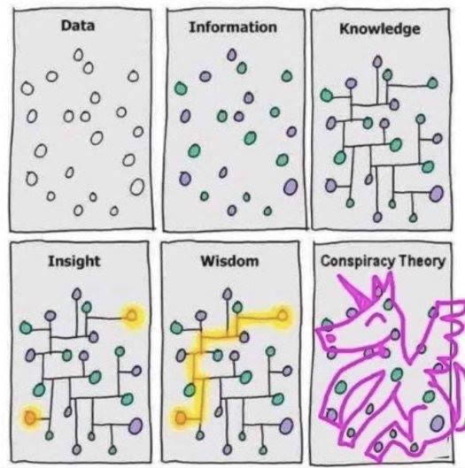

<!-- You can check templates from this website and change html theme: https://www.datadreaming.org/post/r-markdown-theme-gallery/ -->
<!-- It won't affect the PDF or Word. -->

```{r, message=FALSE}
# Insert necessary packages
library('tidyverse')
library('gridExtra')
library('ISLR')
library('plotly')
library('caret')
library('MASS')
library('glmnet')
library('gam')
library('splines')
library('foreach')
```

## Question 1: Nonlinear Regression

### 1.1. Process your data

```{r}
# Read the data
diamonds <- read.csv('data/diamonds.csv')

# Remove all rows that contain NA
diamonds <- na.omit(diamonds)

# Downsample data
diamonds <- diamonds[sample(5000), ]
dim(diamonds)

head(diamonds)
```

### 1.3. Visualize the data

It was decided to do step 1.3. before step 1.2 because before splitting the input data into train and test, it makes more sense to apply the necessary transformations first.

```{r}
histo1 <- ggplot(data = diamonds) +
  geom_histogram(aes(x = z)) +
  ggtitle("Histogram of Diamond Depth")

histo2 <- ggplot(data = diamonds) +
  geom_histogram(aes(x = carat)) + 
  ggtitle("Histogram of Diamond Price")

grid.arrange(histo1, histo2, ncol=2)

```
```{r}
# Remove outliers
diamonds <- diamonds[(diamonds$z>1),]

# Apply logarithmic transform
numeric.cols <- summarize_all(diamonds, is.numeric) %>% unlist()
logDiamonds <- log(diamonds[,numeric.cols])

scatter1 <- ggplot(data = diamonds) +
  geom_point(aes(x = z, y=carat)) + 
  ggtitle("Scatter Plot of Carat vs Z")

scatter2 <- ggplot(data = logDiamonds) +
  geom_point(aes(x = z, y=carat)) + 
  ggtitle("Scatter Plot of Log Carat vs Log Z")

grid.arrange(scatter1, scatter2, ncol=2)
```
After removing some outliers, it can be clearly seen that as z is increased, the carat is also increased.  In terms of linearity, it is slightly non-linear and showing exponential form.  When applying log transform to all the carat and x values, then the relationship is clearly linear.  

### 1.2. Train / Test Split 

```{r}
set.seed(156)
train_inds <- sample(1:nrow(logDiamonds), floor(nrow(logDiamonds)*0.8))
train <- logDiamonds[ train_inds, ]
test  <- logDiamonds[-train_inds, ]

cat('train: ', nrow(train), ', test: ', nrow(test))
```

### 1.4. Fit 4 Models

```{r}
# Linear Regression
fit.lm  <- lm(carat ~ z, data = train)

# Predictions
preds.lm_train <- predict(fit.lm, train)
preds.lm_test <- predict(fit.lm, test)

# RMSE
rmse.lm_train  <- RMSE(preds.lm_train, train$carat)
rmse.lm_test  <- RMSE(preds.lm_test, test$carat)

# Multilinear Regression
fit.mlm <- lm(carat ~ ., data = train)

# Predictions
preds.mlm_train <- predict(fit.mlm, train)
preds.mlm_test <- predict(fit.mlm, test)

# RMSE
rmse.mlm_train  <- RMSE(preds.mlm_train, train$carat)
rmse.mlm_test  <- RMSE(preds.mlm_test, test$carat)

# Polynomial Regression
fit.poly <- lm(carat ~ poly(z,6), data = train)

# Predictions
preds.poly_train <- predict(fit.poly, train)
preds.poly_test <- predict(fit.poly, test)

# RMSE
rmse.poly_train  <- RMSE(preds.poly_train, train$carat)
rmse.poly_test  <- RMSE(preds.poly_test, test$carat)

# Locally Weighted Regression
fit.wlm <- loess(carat ~ z, data=train)

# Predictions
preds.wlm_train <- predict(fit.wlm, train)
preds.wlm_test <- predict(fit.wlm, test)

# RMSE
rmse.wlm_train  <- RMSE(preds.wlm_train, train$carat)
rmse.wlm_test  <- RMSE(preds.wlm_test, test$carat)
```

```{r}

# Plots
linear_plot <- ggplot(test, aes(y=carat, x=z)) + 
  geom_point(alpha=.8, position = position_jitter()) +
  geom_line(aes(y=preds.lm_test), colour = 'steelblue', alpha=.8) + 
  ggtitle(paste0('Linear Regression \nTrain RMSE: ',round(rmse.lm_train, 6), "\nTest RMSE: ", round(rmse.lm_test, 6)))

multilinear_plot <- ggplot(test, aes(y=carat, x=z)) + 
  geom_point(alpha=.8, position = position_jitter()) +
  geom_line(aes(y=preds.mlm_test), colour = 'green', alpha=.8) + 
  ggtitle(paste0('Multilinear Regression \nTrain RMSE: ',round(rmse.mlm_train, 6), "\nTest RMSE: ", round(rmse.mlm_test, 6)))

poly_plot <- ggplot(test, aes(y=carat, x=z)) + 
  geom_point(alpha=.8, position = position_jitter()) +
  geom_line(aes(y=preds.poly_test), colour = 'orange', alpha=.8) + 
  ggtitle(paste0('Polynomial Regression \nTrain RMSE: ',round(rmse.poly_train, 6), "\nTest RMSE: ", round(rmse.poly_test, 6)))

weighted_plot <- ggplot(test, aes(y=carat, x=z)) + 
  geom_point(alpha=.8, position = position_jitter()) +
  geom_line(aes(y=preds.wlm_test), colour = 'firebrick', alpha=.8) + 
  ggtitle(paste0('Locally Weighted Regression \nTrain RMSE: ',round(rmse.wlm_train, 6), "\nTest RMSE: ", round(rmse.wlm_test, 6)))

grid.arrange(linear_plot, multilinear_plot, poly_plot, weighted_plot, ncol=2)
```

Based off of Train RMSE, the order of models from best (lowest RMSE) to worst (highest RMSE) is: 
1. Multilinear Regression
2. Polynomial Regression
3. Locally Weighted Regression tied
4. Linear Regression


Based off of the Test RMSE, the order of models from best (lowest RMSE) to worst (highest RMSE) is: 
1. Multilinear Regression
2. Polynomial Regression
3. Locally Weighted Regression
4. Linear Regression

The order of models from best to worst did not change when ordering by train RMSE or test RMSE.

### 1.5. Cross Validation

```{r, warning=F}
ctrl <- trainControl(method = "repeatedcv", number = 10, repeats=5)

# Linear regression
cv_fit.lm <- train(
  form = carat ~ z, 
  data = train, 
  method = "lm",
  trControl = ctrl
)

preds.cv_lm <- predict(cv_fit.lm,test)
rmse.cv_lm  <- RMSE(preds.cv_lm,test$carat)

# Multilinear regression
cv_fit.mlm <- train(
  form = carat ~ ., 
  data = train, 
  method = "lm",
  trControl = ctrl
)

preds.cv_mlm <- predict(cv_fit.mlm,test)
rmse.cv_mlm  <- RMSE(preds.cv_mlm,test$carat)

# Polynomial regression

cv_fit.poly <- train(
  form = carat ~ poly(z, 6), 
  data = train, 
  method = "lm",
  trControl = ctrl
)

preds.cv_poly <- predict(cv_fit.poly,test)
rmse.cv_poly  <- RMSE(preds.cv_poly,test$carat)

# Locally weighted regression
cv_fit.wlm <- train(
  form = carat ~ z, 
  data = train, 
  method = "gamLoess",
  trControl = ctrl
)

preds.cv_wlm <- predict(cv_fit.wlm,test)
rmse.cv_wlm  <- RMSE(preds.cv_wlm,test$carat)

```

```{r}
cv_linear_plot <- ggplot(test, aes(y=carat, x=z)) + 
  geom_point(alpha=.8, position = position_jitter()) +
  geom_line(aes(y=preds.cv_lm), colour = 'steelblue', alpha=.8) + 
  ggtitle(paste0('Linear Regression \nTest RMSE: ',round(rmse.cv_lm, 6)))

cv_multilinear_plot <- ggplot(test, aes(y=carat, x=z)) + 
  geom_point(alpha=.8, position = position_jitter()) +
  geom_line(aes(y=preds.cv_mlm), colour = 'steelblue', alpha=.8) + 
  ggtitle(paste0('Multilinear Regression \nTest RMSE: ',round(rmse.cv_mlm, 6)))

cv_poly_plot <- ggplot(test, aes(y=carat, x=z)) + 
  geom_point(alpha=.8, position = position_jitter()) +
  geom_line(aes(y=preds.cv_poly), colour = 'steelblue', alpha=.8) + 
  ggtitle(paste0('Polynomial Regression \nTest RMSE: ',round(rmse.cv_poly, 6)))

cv_wlm_plot <- ggplot(test, aes(y=carat, x=z)) + 
  geom_point(alpha=.8, position = position_jitter()) +
  geom_line(aes(y=preds.cv_wlm), colour = 'steelblue', alpha=.8) + 
  ggtitle(paste0('Locally Weighted Regression \nTest RMSE: ',round(rmse.cv_wlm, 6)))

grid.arrange(cv_linear_plot, cv_multilinear_plot, cv_poly_plot, cv_wlm_plot, ncol=2)
```
Based off of the Test RMSE, the order of models from best (lowest RMSE) to worst (highest RMSE) is: 
1. Multilinear Regression
2. Locally Weighted Regression
3. Polynomial Regression
4. Linear Regression

The order of models have changed when adding k fold cross validation.  The Locally Weighted Regression is now second best and moved in front of Polynomial Regression.  Therefore, by applying cross validation, more precise performance metrics have been measured for the models. 

### 1.6. Shrinkage

```{r}
x_train <- model.matrix(carat ~ z,train)
x_train_multi <- model.matrix(carat ~ .,train)
x_train_poly <- model.matrix(carat ~ poly(z,6),train)
y_train <- train$carat

x_test <- model.matrix(carat ~ z,test)
x_test_multi <- model.matrix(carat ~ .,test)
x_test_poly <- model.matrix(carat ~ poly(z, 6),test)

# Ridge
fit.ridge_lm  <- cv.glmnet(x_train,y_train,alpha=0, nfolds = 10)
fit.ridge_lm <- glmnet(x_train,y_train,alpha=0, lambda=fit.ridge_lm$lambda.min)

fit.ridge_mlm  <- cv.glmnet(x_train_multi,y_train,alpha=0, nfolds = 10)
fit.ridge_mlm <- glmnet(x_train_multi,y_train,alpha=0, lambda=fit.ridge_mlm$lambda.min)

fit.ridge_poly  <- cv.glmnet(x_train_poly,y_train,alpha=0, nfolds = 10)
fit.ridge_poly <- glmnet(x_train_poly,y_train,alpha=0, lambda=fit.ridge_poly$lambda.min)


preds.ridge_lm <- predict(fit.ridge_lm, x_test)
preds.ridge_mlm <- predict(fit.ridge_mlm, x_test_multi)
preds.ridge_poly <- predict(fit.ridge_poly, x_test_poly)

rmse.ridge_lm <- RMSE(preds.ridge_lm, test$carat)
rmse.ridge_mlm <- RMSE(preds.ridge_mlm, test$carat)
rmse.ridge_poly <- RMSE(preds.ridge_poly, test$carat)

# Lasso
fit.lasso_lm  <- cv.glmnet(x_train,y_train,alpha=1, nfolds = 10)
fit.lasso_lm <- glmnet(x_train,y_train,alpha=1, lambda=fit.lasso_lm$lambda.min)

fit.lasso_mlm  <- cv.glmnet(x_train_multi,y_train,alpha=1, nfolds = 10)
fit.lasso_mlm <- glmnet(x_train_multi,y_train,alpha=1, lambda=fit.lasso_mlm$lambda.min)

fit.lasso_poly  <- cv.glmnet(x_train_poly,y_train,alpha=1, nfolds = 10)
fit.lasso_poly <- glmnet(x_train_poly,y_train,alpha=1, lambda=fit.lasso_poly$lambda.min)

preds.lasso_lm <- predict(fit.lasso_lm, x_test)
preds.lasso_mlm <- predict(fit.lasso_mlm, x_test_multi)
preds.lasso_poly <- predict(fit.lasso_poly, x_test_poly)

rmse.lasso_lm <- RMSE(preds.lasso_lm, test$carat)
rmse.lasso_mlm <- RMSE(preds.lasso_mlm, test$carat)
rmse.lasso_poly <- RMSE(preds.lasso_poly, test$carat)

```

```{r}
# Ridge 
ridge_lm <-ggplot(test, aes(y=carat, x=z)) + 
  geom_point(alpha=.8, position = position_jitter()) +
  geom_line(aes(y=preds.ridge_lm), colour = 'steelblue', alpha=.8) + 
  ggtitle(paste0('Ridge Linear Regression \nTest RMSE: ',round(rmse.ridge_lm, 6)))

ridge_mlm <- ggplot(test, aes(y=carat, x=z)) + 
  geom_point(alpha=.8, position = position_jitter()) +
  geom_line(aes(y=preds.ridge_mlm), colour = 'steelblue', alpha=.8) + 
  ggtitle(paste0('Ridge MultiLinear Regression \nTest RMSE: ',round(rmse.ridge_mlm, 6)))

ridge_poly <- ggplot(test, aes(y=carat, x=z)) + 
  geom_point(alpha=.8, position = position_jitter()) +
  geom_line(aes(y=preds.ridge_poly), colour = 'steelblue', alpha=.8) + 
  ggtitle(paste0('Ridge Polynomial Regression \nTest RMSE: ',round(rmse.ridge_poly, 6)))

# Lasso
lasso_lm <-ggplot(test, aes(y=carat, x=z)) + 
  geom_point(alpha=.8, position = position_jitter()) +
  geom_line(aes(y=preds.lasso_lm), colour = 'steelblue', alpha=.8) + 
  ggtitle(paste0('Lasso Linear Regression \nTest RMSE: ',round(rmse.lasso_lm, 6)))

lasso_mlm <- ggplot(test, aes(y=carat, x=z)) + 
  geom_point(alpha=.8, position = position_jitter()) +
  geom_line(aes(y=preds.lasso_mlm), colour = 'steelblue', alpha=.8) + 
  ggtitle(paste0('Lasso MultiLinear Regression \nTest RMSE: ',round(rmse.lasso_mlm, 6)))

lasso_poly <- ggplot(test, aes(y=carat, x=z)) + 
  geom_point(alpha=.8, position = position_jitter()) +
  geom_line(aes(y=preds.lasso_poly), colour = 'steelblue', alpha=.8) + 
  ggtitle(paste0('Lasso Polynomial Regression \nTest RMSE: ',round(rmse.lasso_poly, 6)))

grid.arrange(ridge_lm, ridge_mlm, ridge_poly, ncol=2)

grid.arrange(lasso_lm, lasso_mlm, lasso_poly, ncol=2)
```
The model that yielded the lowest RMSE was Lasso Multilinear Regression.  Based off of the Test RMSE, the order of models from best (lowest RMSE) to worst (highest RMSE) is: 
1. Lasso Multilinear Regression
2. Ridge Multilinear Regression
3. Lasso Linear Regression
4. Ridge Linear Regression
5. Ridge Polynomial Regression
6. Lasso Polynomial Regression

\pagebreak

## Question 2

```{r}

```

\pagebreak

## Question 3

$$\theta := \theta + \frac \alpha N X^T(Y - \theta X)$$

